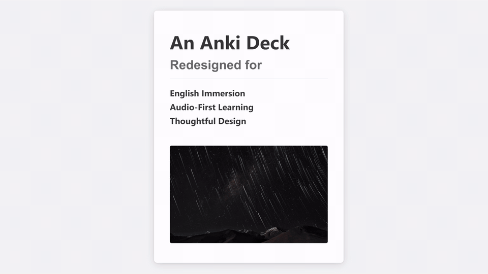

# Mneme 

An Anki template built for immersion and audio-first learning, with a clean and thoughtful visual design

## Preview

*Click the animation above to watch the full demo on YouTube.*

---

## Key Features

###  **Designed for Cognition:**

-   **Minimal Cognitive Unit:** Each card is structured to present one core idea, reducing cognitive load and enhancing focus.
-   **Audio-First Interface:** Prioritizes listening by playing audio *before* text is revealed, aligning with natural language acquisition.

###  **Modern Finesse & Design:**

-   **Minimal & Modern UI:** A clean, distraction-free interface that's beautiful and functional.
-   **Adaptive Theme:** Automatically supports system-wide Light & Dark modes.
-   **Fully Responsive:** Optimized for both Desktop and Mobile.

###  **Modular & Customizable:**

-   **Modular Translations:** Easily enable optional language support with a single switch.
-   **Button-Free Workflow:** Designed for keyboard and gesture power users.

### **Progress & Motivation**

-   **Milestone Notifications:** Receive clean, encouraging pop-ups at key milestones to help build rhythm and a sense of achievement. Due to platform limitations, counter persistence varies:
    -   **Android (AnkiDroid):** Counter persists across app restarts and resets daily at 4 AM
    -   **Desktop (Windows/Mac/Linux):** Counter persists while Anki is running, resets when you close the app
    -   **iOS (AnkiMobile):** Counter persists during your study session, resets when you exit to the main deck screen
-   **Template-Based Customization:** Easily edit the motivational messages and trigger frequency directly within the card template code.

## Feedback & Community

-   **Bugs & Suggestions**: [Open an Issue](https://github.com/campfirium/Mneme/issues)
-   **Discussion & Guides**: [Campfirium Forum](https://campfirium.info)

---

  A project by <strong>Campfirium</strong>

